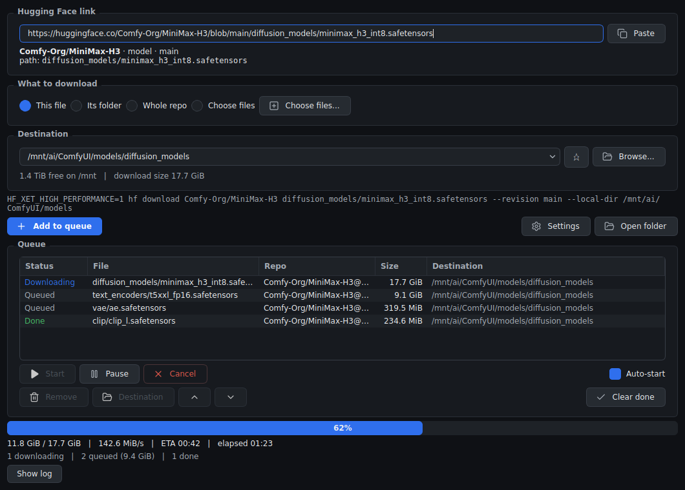

# Fantastic HuggingFace Downloader

A desktop front end for the Hugging Face command line, for people who would
rather not use a command line.

Paste a link, pick a folder, and it downloads — with a queue, real progress,
and a proper integrity check. Built because pulling multi-gigabyte model
weights through a browser is miserable: downloads stall near the end, resume
badly or not at all, silently truncate, and leave you with a file that looks
fine until something tries to load it.



## What it does

- **Paste a link, get the file.** Any `huggingface.co` link — a file, a folder,
  or a whole repo. It works out the repo, branch and path for you.
- **A real queue.** Add as much as you like, from as many different repos as
  you like, while something is already downloading. Items run one at a time so
  they are not fighting each other for bandwidth. Reorder, pause, cancel, or
  send individual items to a different drive.
- **Monitor progress.** Percentage, transfer speed and time remaining, all
  measured from the same number so they agree with each other.
- **Files are verified.** Downloading something again checks what is already on
  disk against the copy on the Hub and only re-fetches if it genuinely differs.
- **Fast transfers.** Uses Hugging Face's Xet high-performance path, the same
  thing the CLI uses, rather than a plain browser download.
- **See the command it runs.** The exact command is shown above the button,
  and a log pane shows everything it produced.

## Downloading a file, a folder, or a whole repo

Four choices, and the app picks the sensible one from the link you pasted:

| | |
|---|---|
| **This file** | Just the one your link points at. |
| **Its folder** | Everything in that same folder in the repo. |
| **Whole repo** | All of it. |
| **Choose files** | Tick exactly what you want from a list, with sizes. |

**Choose files** opens the repo's file listing with everything already ticked,
so the job is unticking what you do not want rather than hunting for what you
do. If your link pointed at a subfolder, only that subfolder is listed — one
checkbox widens it to the whole repo if you need something else as well.

Picked files are queued as one job each, so selecting forty files gives you
forty queue entries you can reorder, retry or redirect individually.

## Sending files where you actually want them

Repos are usually laid out to mirror the folder structure of whatever consumes
them — a ComfyUI model repo has `diffusion_models/`, `text_encoders/`, `vae/`
and so on. That is convenient when it lines up with your setup and annoying
when it does not.

So the destination box means *where this file should end up*, not *where to
dump the repo*. Link to a single file and it lands in the folder you picked,
full stop — no subfolder is created for it.

Folder, whole-repo and chosen-files downloads are different: those keep the
repo's structure underneath the folder you pick, because there the layout is
usually the reason you wanted the whole thing. A line under the box tells you
where files will actually land before you commit to anything.

Each queued item remembers its own destination, so you can point some files at
one drive and the rest at another. Frequently used folders can be starred and
stay at the top of the list.

## Verifying downloads

Large model files are exactly the kind of thing that fails quietly. Re-adding a
download you have already done reads the file on your disk, compares it against
the Hub's own checksum, and only downloads again if they do not match. A
half-written or corrupted file gets replaced; an intact one is left alone.

It also cleans up after itself, so it does not scatter bookkeeping files around
your model folders.

## Installing

You need Python 3.9 or newer and `git`. Everything else is installed into the
folder you clone into, and nothing needs administrator rights.

```
git clone https://github.com/Adudeguyman/Fantastic-HuggingFace-Downloader.git
cd Fantastic-HuggingFace-Downloader
```

**Linux** — run `./install.sh`, or double-click it in your file manager and
choose "Run in Terminal". Afterwards, start the app with `run.sh`.

**Windows** — run or double-click `install.bat`. Afterwards, start the app with
`run.bat`. Install Python from [python.org](https://www.python.org/downloads/)
first, ticking "Add python.exe to PATH". *Windows support is written but has
not been tested on a Windows machine — [reports welcome](https://github.com/Adudeguyman/Fantastic-HuggingFace-Downloader/issues).*

The installer asks before creating anything outside the folder. A menu entry, a
desktop shortcut and a terminal command are three separate questions, all
optional, all defaulting to no.

To update, run the installer again. It does the `git pull` for you and only
reinstalls dependencies if they actually changed, so it takes a second when
nothing has moved.

To remove it, delete the folder. Run `uninstall.sh` or `uninstall.bat` first if
you accepted any of the optional shortcuts.

## Private and gated repos

It uses whatever login the Hugging Face CLI already has. If a download fails
with a permissions error, log in once with `hf auth login` and try again.

## Appearance

Dark theme, with the accent colour adjustable — put `accent=#c2410c`, or any
colour you like, in `settings.ini` in the app folder and restart. Everything
else follows from it.

## Notes

`README.txt` in the app folder is the full manual, including what to do when
something goes wrong.

Not affiliated with Hugging Face. It drives their `hf` command line tool,
which does the actual transferring.

## License

MIT — see [LICENSE](LICENSE).
